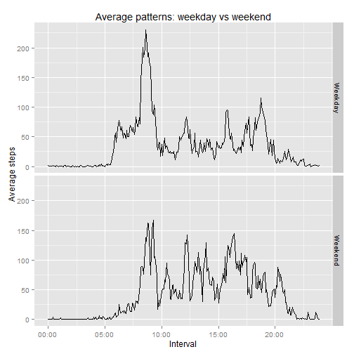

###REPRODUCIBLE RESEARCH: PEER ASSESSMENT 1  

###Loading and preprocessing the data  

Data and required libraries are loaded.

Note:data will be processed for each purpose in its corresponding chunk of code 


```r
data <- read.csv("activity.csv")
library('dplyr')
library('lubridate')
library('chron')
library('ggplot2')
```

###What is mean total number of steps taken per day?

To answer this question, data are processed to show the total number of steps taken each day (ignoring the missing values) and therefore be able to make the histogram.


```r
stepdata <- summarise(group_by(data,date),totalsteps=sum(steps,na.rm=TRUE))
averagesteps <- mean(stepdata$totalsteps)
mediansteps <- median(stepdata$totalsteps)
hist(stepdata$totalsteps,main='Histogram: total number of steps taken per day',xlab='Steps',col='red')
```

 


The mean of the total number of steps taken per day is **9354.2295082**.  

The median of the total number of steps taken per day is **10395**.

###What is the average daily activity pattern?

In this case, data are processed to show the mean number of steps taken each
5-minutes interval. Also the time span between intervals is corrected in order 
to plot the time series correctly (note that there is a problem when moving 
from a given hour to the next one, e.g., from 00:55 to 01:00 the intervals are
55 and 100 respectively so it would represent a time span of 45 minutes instead of 5 minutes, and therefore distorting the graph).  


```r
pattern <- summarise(group_by(data,interval),steps=mean(steps,na.rm=TRUE))
pattern <- mutate(pattern,time=time(interval))
maxstepsint <- pattern$interval[which(pattern$steps==max(pattern$steps))]
maxstepstime <- strptime(sprintf("%04d",maxstepsint),format="%H%M")
h <- hour(maxstepstime)
m <- minute(maxstepstime)
plot(pattern$time,pattern$steps,type='l',main='Average daily activity pattern',xlab='Interval',ylab='Average Steps',xaxp=c(1,241,4),xaxt="n")
axis(side=1,at=c(1,61,121,181,241),labels=c("00:00","05:00","10:00","15:00","20:00"))
```

 


The 5-minute interval with the highest average number of steps is **8:35** with an average of **206.1698113** steps.

###Imputing missing values


```r
NumberNAs <- sum(is.na(data$steps))
```

The number of missing values (NA's) is **2304**.  

The strategy for filling in all of the missing values and for creating a new dataset consists in replacing each missing value with the average number of steps taken in its corresponding interval.

Data are processed to make the histogram and to calculate the average and the median like in the first part of the assignment.


```r
dataNA <- data
for (i in 1:length(dataNA$steps)) {
  if (is.na(dataNA$steps[i])==TRUE){
    dataNA$steps[i]=pattern$steps[which(pattern$interval==dataNA$interval[i])]
    }
  }
stepdataNA <- summarise(group_by(dataNA,date),totalsteps=sum(steps,na.rm=TRUE))
options(scipen=1)
averagestepsNA <- mean(stepdataNA$totalsteps)
medianstepsNA <- median(stepdataNA$totalsteps)
hist(stepdataNA$totalsteps,main='Histogram: total number of steps taken per day',xlab='Steps',col='red')
```

 

The mean of the total number of steps taken per day is **10766.1886792**.  

The median of the total number of steps taken per day is **10766.1886792**.

These values differ from the estimates from the first part of the assignment.
Note that both values are in this case greater than the values in the first part.

The impact can be seen having a look at both histograms. In this part, it shows
a distribution that looks pretty much alike a normal distribution (note that in
this case, both mean and median are the same value).

###Are there differences in activity patterns between weekdays and weekends?

This time data are processed using the "filled-in" data from the previous part.
Weekdays and weekends are processed separately to get their average values and
to correct the aforementioned problem with the time span between intervals.
Then both situations are plotted using the ggplot2 system.


```r
data2 <- mutate(dataNA,day=is.weekend(ymd(dataNA$date)))
for (i in 1:length(data2$day)) {
  if (data2$day[i]==FALSE) {
    data2$day[i]='Weekday'
  }
  else { 
    data2$day[i]='Weekend'
  }
}
weekday <- filter(data2,day=="Weekday")
weekend <- filter(data2,day=="Weekend")
avgweekday <- summarise(group_by(weekday,interval),steps=mean(steps,na.rm=TRUE))
avgweekday <- mutate(avgweekday,time=time(interval),day="Weekday")
avgweekend <- summarise(group_by(weekend,interval),steps=mean(steps,na.rm=TRUE))
avgweekend <- mutate(avgweekend,time=time(interval),day="Weekend")
avgweekdata<-rbind(avgweekday,avgweekend)
graph<-qplot(time,steps,data=avgweekdata,facets=day~.,main="Average patterns: weekday vs weekend",xlab="Interval",ylab="Average steps",geom="line")
graph+scale_x_continuous(breaks=c(1,61,121,181,241),labels=c("00:00","05:00","10:00","15:00","20:00"))
```

 
