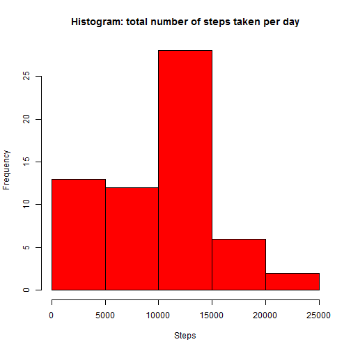
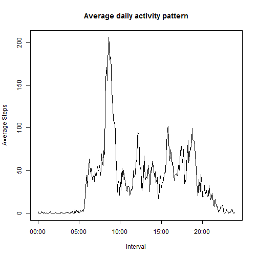
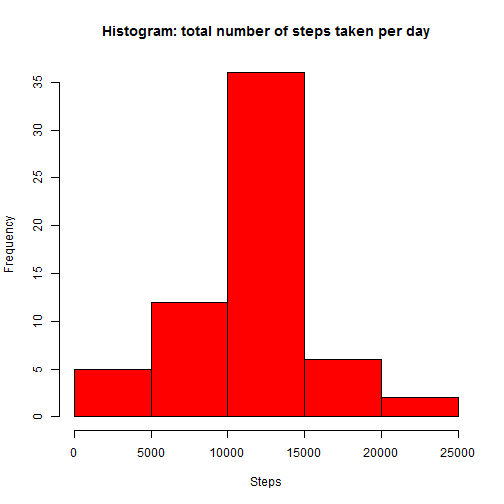
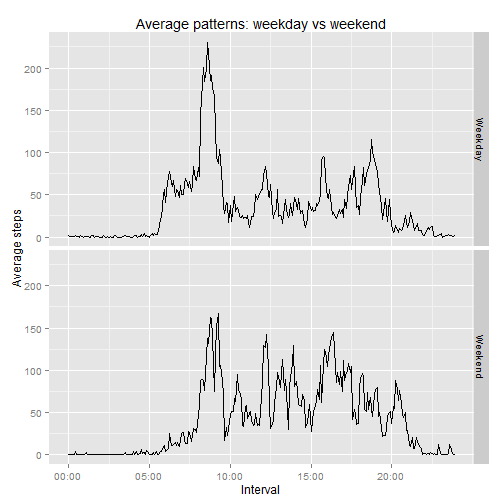

###REPRODUCIBLE RESEARCH: PEER ASSESSMENT 1  

###Loading and preprocessing the data  

```r
data <- read.csv("activity.csv")
library(dplyr)
```
###What is mean total number of steps taken per day?

```r
stepdata <- summarise(group_by(data,date),totalsteps=sum(steps,na.rm=TRUE))
averagesteps <- mean(stepdata$totalsteps)
mediansteps <- median(stepdata$totalsteps)
hist(stepdata$totalsteps,main='Histogram: total number of steps taken per day',xlab='Steps',col='red')
```

 


The mean of the total number of steps taken per day is **9354.2295082**.  

The median of the total number of steps taken per day is **10395**.

###What is the average daily activity pattern?


```r
pattern <- summarise(group_by(data,interval),steps=mean(steps,na.rm=TRUE))
pattern <- mutate(pattern,time=time(interval))
maxstepsint <- pattern$interval[which(pattern$steps==max(pattern$steps))]
maxstepstime <- strptime(sprintf("%04d",maxstepsint),format="%H%M")
library('lubridate')
h <- hour(maxstepstime)
m <- minute(maxstepstime)
plot(pattern$time,pattern$steps,type='l',main='Average daily activity pattern',xlab='Interval',ylab='Average Steps',xaxp=c(1,241,4),xaxt="n")
axis(side=1,at=c(1,61,121,181,241),labels=c("00:00","05:00","10:00","15:00","20:00"))
```

 


The 5-minute interval with the highest average number of steps is **8:35**.   

The highest average number of steps in a 5-minute interval is **206.1698113**. 

###Imputing missing values

```r
NumberNAs <- sum(is.na(data$steps))
```

The number of NA's is **2304**.


```r
dataNA <- data
for (i in 1:length(dataNA$steps)) {
  if (is.na(dataNA$steps[i])==TRUE){
    dataNA$steps[i]=pattern$steps[which(pattern$interval==dataNA$interval[i])]
    }
  }
stepdataNA <- summarise(group_by(dataNA,date),totalsteps=sum(steps,na.rm=TRUE))
options(scipen=1)
averagestepsNA <- mean(stepdataNA$totalsteps)
medianstepsNA <- median(stepdataNA$totalsteps)
hist(stepdataNA$totalsteps,main='Histogram: total number of steps taken per day',xlab='Steps',col='red')
```

 

The mean of the total number of steps taken per day is **10766.1886792**.  

The median of the total number of steps taken per day is **10766.1886792**.


###Are there differences in activity patterns between weekdays and weekends?


```r
library('chron')
data2 <- mutate(dataNA,day=is.weekend(ymd(dataNA$date)))
for (i in 1:length(data2$day)) {
  if (data2$day[i]==FALSE) {
    data2$day[i]='Weekday'
  }
  else { 
    data2$day[i]='Weekend'
  }
}
weekday <- filter(data2,day=="Weekday")
weekend <- filter(data2,day=="Weekend")
avgweekday <- summarise(group_by(weekday,interval),steps=mean(steps,na.rm=TRUE))
avgweekday <- mutate(avgweekday,time=time(interval),day="Weekday")
avgweekend <- summarise(group_by(weekend,interval),steps=mean(steps,na.rm=TRUE))
avgweekend <- mutate(avgweekend,time=time(interval),day="Weekend")
avgweekdata<-rbind(avgweekday,avgweekend)
```


```r
library(ggplot2)
graph<-qplot(time,steps,data=avgweekdata,facets=day~.,main="Average patterns: weekday vs weekend",xlab="Interval",ylab="Average steps",geom="line")
graph+scale_x_continuous(breaks=c(1,61,121,181,241),labels=c("00:00","05:00","10:00","15:00","20:00"))
```

 
  
The figure above shows the average activity patterns for weekdays and weekends
